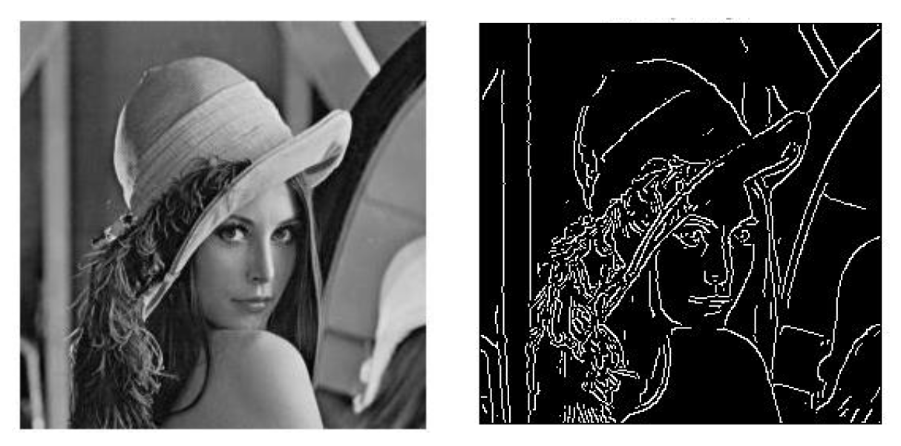

# Canny Edge Detector
Implementation of Canny Edge Detection algorithm from scratch in MATLAB

  

## Contents
* [Overview](#overview)
* [Motivation](#motivation)
* [Setup](#setup)
* [Repository files](#repository-files)
* [Report](#report)
* [Observations](#observations)
* [What did I learn](#what-did-i-learn)

## Overview
Edge detection is an essential step in image analysis. It is used to detect the boundaries/edges in the image. It works by detecting discontinuities in image brightness. The points at which image brightness changes sharply are organized into a set of curved line segments called edges.

## Motivation
Edge detection is used in various fields such as image segmentation and data extraction in areas such as image processing, computer vision and machine vision. Generally, objects in any image has more intensity than the background on the edges. this makes it easier for a computer to identify or track an object once its edge is detected. These many uses of edge detection motivated me for this project

## Setup
Windows 10 
MATLAB Software

## Repository files
canny_edge.m  : MATLAB code of the project
 edge detection report : details of the project
 images : images for README file
 observation_images : images in observation section of README
 

## Report
A detailed report is given in the file "edge detection report.pdf"

  

## Observations

  
  

  
  

  
  

  
  

  
  

## What did I learn?
* Gaussian Blur
* Sobel Filter
* Non-maximum Suppression
* Double Thresholding
* Edge Hysteresis

This project will help in further study about image processing and computer vision.

